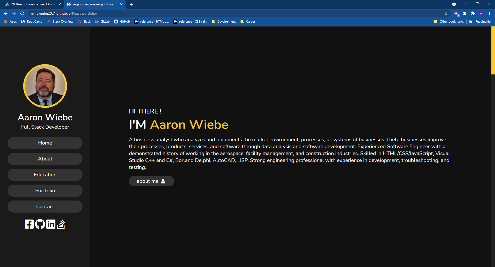

# React Portfolio 

## Description 

**React Challenge: React Portfolio**

**Challenge Elements**\
The task is to create a portfolio, using your new React skills to help set you apart from other developers whose portfolios don’t use the latest technologies.

## Installation

You are required to submit BOTH of the following for review:
*The URL of the functional, deployed application.
*The URL of the GitHub repository, with a unique name and a README describing the project.

-The link to the page: https://awiebe2021.github.io/fresh-profile/ \
-The projects code can be accessed at: https://github.com/AWiebe2021/fresh-profile

## Screenshot

## Credits
Solo project
